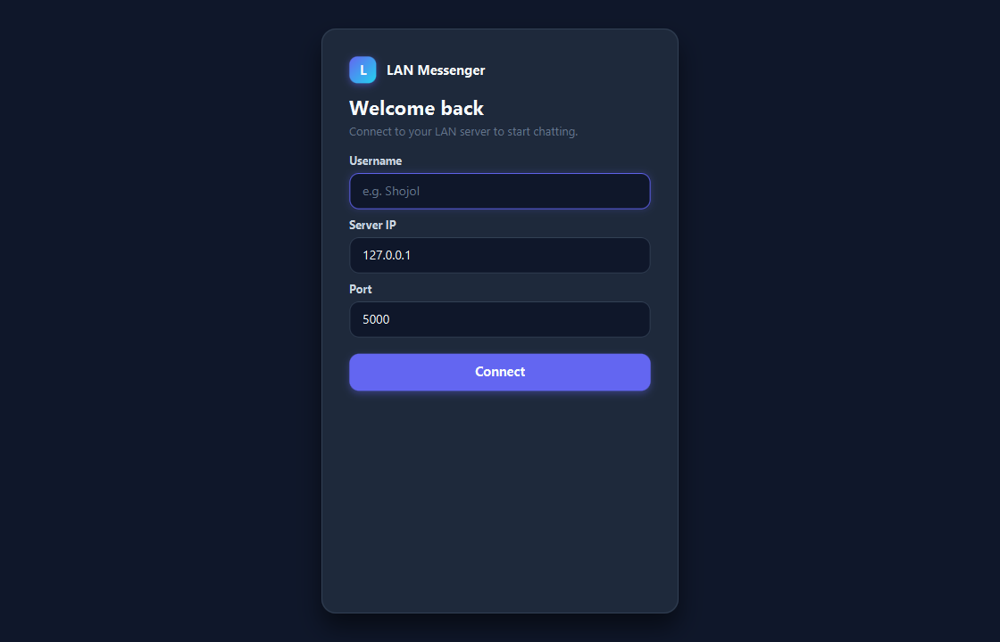
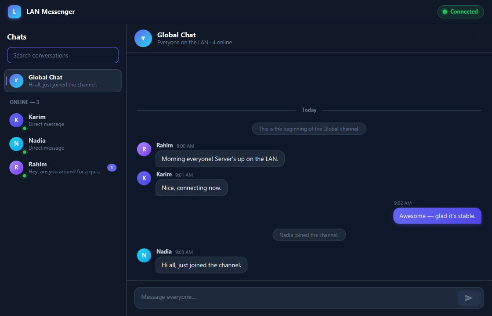

# LAN Messenger

A desktop chat application for a Local Area Network (LAN). Multiple people on the
same network run the **client**, connect to one central **server**, and exchange
messages in a shared public room or in one-to-one private conversations. Clients
never talk to each other directly — every message is routed through the server.

The project was built as a university software engineering project to demonstrate
Java networking (TCP sockets), multithreading, a desktop GUI (JavaFX), and local
data persistence (SQLite via JDBC), organised as a clean multi-module Maven build.

---

## Table of contents

- [Description](#description)
- [Features](#features)
- [Screenshots](#screenshots)
- [Architecture](#architecture)
- [Technologies](#technologies)
- [Requirements](#requirements)
- [Installation](#installation)
- [Running the server](#running-the-server)
- [Running the client](#running-the-client)
- [Configuration](#configuration)
- [Database](#database)
- [Networking](#networking)
- [Multithreading](#multithreading)
- [Project structure](#project-structure)
- [Git workflow](#git-workflow)
- [Future improvements](#future-improvements)

---

## Description

LAN Messenger uses a classic **client–server** model:

- The **server** is a headless console program. It listens on a TCP port, accepts
  any number of clients, keeps track of who is online, and forwards messages to
  the right recipients.
- The **client** is a JavaFX desktop app. The user enters a username, the server's
  IP address and its port, connects, and then chats. The interface has a sidebar
  of online users, a shared **Global** room, and a private conversation per user.

Everything the two sides need to agree on — the message format, the default port,
username rules — lives in a shared **common** module, so the client and server can
never drift apart.

---

## Features

- **Central TCP server** that accepts many clients at once, each on its own thread.
- **Username login** with validation and a friendly rejection when a name is
  already taken or invalid.
- **Live online-users list** in the sidebar that updates as people join and leave,
  with a running count.
- **Global chat** — one shared room that every logged-in user is part of.
- **Private (one-to-one) messaging** — click a user to open a direct conversation
  delivered only to that person.
- **Unread badges** on sidebar rows for conversations you are not currently viewing.
- **Local chat history** — conversations are saved to a local SQLite database and
  reloaded when you reopen the app.
- **Multi-line messages** — Enter sends, Shift+Enter adds a new line.
- **Message validation** — blank messages are ignored and over-long messages are
  capped, on the server side, so a client cannot flood the room.
- **Graceful error handling** — clear feedback for an unreachable server, a dropped
  connection, a message to an offline user, or a database that cannot be opened.
- **Clean shutdown** — the server stops cleanly on `Ctrl+C`; the client disconnects
  and closes its database when its window is closed.

---

## Screenshots

> _Screenshots to be added._
>
> Suggested captures:
> - `docs/screenshots/connect.png` — the connection screen (username, IP, port)
> - `docs/screenshots/global-chat.png` — the Global room with several users online
> - `docs/screenshots/private-chat.png` — a one-to-one private conversation
>
> Once added, embed them like this:
>
> ```markdown
> 
> 
> ```

---

## Architecture

The project is a **multi-module Maven build** with three modules and a clear
separation of concerns:

| Module   | Responsibility                                                                         |
|----------|----------------------------------------------------------------------------------------|
| `common` | Shared protocol and model code (`Message`, `MessageType`, `Protocol`, `Usernames`).    |
| `server` | The central TCP server: accepts connections, tracks online users, routes messages.     |
| `client` | The JavaFX desktop app: networking layer, chat UI, and local SQLite chat history.      |

High-level picture (all clients connect to the one server):

```
        +------------------+                +------------------+
        |   Client (Ali)   |                |  Client (Bob)    |
        |  JavaFX UI        |                |  JavaFX UI       |
        |  net + history    |                |  net + history   |
        +---------+--------+                 +--------+---------+
                  |  TCP (port 5000)                  |
                  +----------------+ +----------------+
                                   | |
                            +------v-v-------+
                            |    Server      |
                            |  ChatServer    |
                            |  ClientManager |
                            |  ClientHandler |  (one per client, on its own thread)
                            +----------------+
```

Inside the client, responsibilities are layered so that networking, persistence
and the UI never depend on each other's internals:

```
JavaFX UI (client.ui)  ─▶ ClientController ─▶ ChatClient (client.net) ─▶ TCP socket
        ▲                                            │
        │  Platform.runLater (FxChatClientListener)  │  background reader/sender threads
        └────────────────────────────────────────────┘

client.history / client.data  ─▶ SQLite database  (all on one background thread)
```

Key design ideas:

- The **`common`** module holds the single source of truth for the wire format and
  the username rules, so both sides always agree.
- The client's **networking layer (`client.net`)** contains no JavaFX code, so it
  can be tested without a UI. A thin bridge, `FxChatClientListener`, is the only
  place where networking meets JavaFX.
- **Persistence (`client.data` + `client.history`)** is isolated from the UI and
  networking, and every database call runs on a dedicated background thread.

---

## Technologies

- **Java 21** (compiled with `--release 21`; also runs on newer JDKs such as 25)
- **JavaFX 21** (`javafx-controls`) for the desktop UI
- **Maven** (multi-module build)
- **TCP sockets + multithreading** from the Java standard library
- **SQLite** via **JDBC** (`org.xerial:sqlite-jdbc`) for local chat history
- **JUnit 5** for unit and integration tests
- **Git** for version control

---

## Requirements

- **JDK 21 or newer** (JDK 25 works)
- **Maven 3.9+**
- All application dependencies (JavaFX, SQLite JDBC, JUnit) are resolved
  automatically by Maven — no manual downloads are needed.

---

## Installation

Clone the repository and build all three modules from the project root:

```bash
git clone <your-repository-url>
cd lan-messenger
mvn clean install
```

> **Use `install`, not just `package`.** The run commands below use `-pl`
> (single-module) invocations that resolve the shared `common` module from your
> local Maven repository. `mvn clean install` keeps `common` up to date there;
> otherwise a `-pl server`/`-pl client` run could link against a stale `common`.

To run the automated tests on their own:

```bash
mvn test
```

---

## Running the server

Start the server from the project root. By default it listens on TCP port **5000**:

```bash
mvn -pl server exec:java
```

To use a different port:

```bash
mvn -pl server exec:java -Dexec.args="5050"
```

The server logs each connection, login, and disconnect. Press **`Ctrl+C`** to stop
it — it disconnects clients and shuts down gracefully.

> Find the server machine's LAN IP address (for example with `ipconfig` on Windows
> or `ip addr` / `ifconfig` on Linux/macOS) and share it with the other users so
> their clients can connect.

---

## Running the client

Start the client from the project root:

```bash
mvn -pl client javafx:run
```

The app opens on a **connection screen**. Enter:

1. a **username** (1–24 characters: letters, digits, `.`, `_`, `-`),
2. the **server IP** (use `localhost` if the server runs on the same machine, or
   the server machine's LAN IP otherwise), and
3. the **port** (default `5000`).

Click **Connect**. On success the messenger opens into the shared Global room; other
online users appear in the sidebar, where you can click any of them to start a
private conversation. Run the client on several machines (or several times on one
machine, using different usernames) to chat between them.

---

## Configuration

| Setting            | Where                                   | Default          | How to override                                                                 |
|--------------------|-----------------------------------------|------------------|---------------------------------------------------------------------------------|
| Server port        | Server                                  | `5000`           | `-Dexec.args="<port>"`, or the `lanmessenger.port` system property              |
| Server IP & port   | Client (connection screen)              | `localhost:5000` | Typed into the connect screen at launch                                         |
| Username rules     | `common/Usernames`                      | 1–24 chars       | Shared constant, enforced by both client and server                             |
| Max message length | `common/Protocol.MAX_MESSAGE_LENGTH`    | `2000`           | Shared constant                                                                 |
| Database location  | Per-user app data directory (see below) | platform default | `-Dlanmessenger.data.dir=<dir>` system property                                 |

The server resolves its port with a simple precedence: a command-line argument
(e.g. `--port 5050`, `-p 5050`, or a lone number) first, then the
`lanmessenger.port` system property, otherwise the default `5000`.

---

## Database

Chat history is stored **locally on each client** in an **SQLite** database,
accessed through **JDBC** (`org.xerial:sqlite-jdbc`).

**Where the database lives.** It is created in the per-user application data
directory, *outside* the project folder, so it is never committed to Git:

- **Windows** — `%LOCALAPPDATA%\LanMessenger\chat-history.db`
- **macOS** — `~/Library/Application Support/LanMessenger/chat-history.db`
- **Linux** — `~/.local/share/lan-messenger/chat-history.db`

You can point it somewhere else (handy for testing) with
`-Dlanmessenger.data.dir=<dir>`.

**Schema.** Two tables:

- **`messages`** — `id` (auto-increment primary key), `owner` (the logged-in user,
  so several users on one machine keep separate histories), `sender`, `recipient`
  (empty for global messages), `content`, `type` (`GLOBAL_MESSAGE` or
  `PRIVATE_MESSAGE`) and `timestamp` (ISO-8601 text). Two indexes speed up the two
  read patterns (a user's global feed, and a one-to-one thread with a peer).
- **`users`** — `username`, `first_seen`, `last_seen`: a small registry of every
  username the client has seen.

**Behaviour.**

- Every delivered message (global or private, incoming or outgoing) is saved; when
  a conversation is opened, its stored messages are loaded back into the view.
- System notices (joins, leaves, "beginning of conversation", delivery failures)
  are treated as temporary and are **not** stored.
- **All** database work runs on a single background thread and results are handed
  back to the UI thread, so the interface never freezes on a query.
- If the database cannot be opened, the client logs it once and simply runs with
  history disabled (empty history) instead of crashing.

---

## Networking

Communication uses plain **TCP sockets** with a simple, text-based protocol.

**Wire format.** Every message is a single line of UTF-8 text with four
pipe-separated fields:

```
TYPE|sender|recipient|content
```

`content` is always the last field, so it may safely contain the `|` character.
Newlines inside a message are encoded so a message always stays on one physical
line and survives the round-trip. The message types are:

`LOGIN`, `LOGIN_SUCCESS`, `LOGIN_FAILED`, `GLOBAL_MESSAGE`, `PRIVATE_MESSAGE`,
`USER_LIST`, `USER_JOINED`, `USER_LEFT`, `DISCONNECT`, and `ERROR`.

Adding a new capability later is as easy as adding a new type — nothing else in
the parsing needs to change.

**How a conversation flows.**

1. A client opens a TCP socket to the server and sends a `LOGIN` with its username.
2. The server validates the name; on success it replies `LOGIN_SUCCESS`, sends the
   current `USER_LIST`, and tells everyone else `USER_JOINED`.
3. A `GLOBAL_MESSAGE` is re-stamped by the server with the authenticated sender and
   broadcast to every *other* client (the sender shows its own copy locally).
4. A `PRIVATE_MESSAGE` is forwarded to **only** the named recipient. If that user is
   not online (or you address yourself), the server replies with an `ERROR` tagged
   with the intended recipient so the client can show the notice in the right place.
5. When a client leaves — cleanly or by crashing — the server detects it, cleans up,
   and broadcasts `USER_LEFT`.

**Robustness.** Sockets enable `TCP_NODELAY` (prompt delivery of small messages) and
`SO_KEEPALIVE` (so a peer that vanishes is eventually detected). A malformed line or
a single misbehaving client is contained and never takes down the server.

---

## Multithreading

Both sides are multithreaded so that slow or blocking I/O never freezes anything.

**Server.**

- One **acceptor thread** runs the `accept()` loop, waiting for new connections.
- Each accepted client is handled by its **own thread** from a cached thread pool
  (a "thread per client" model), so many clients are served at the same time.
- The shared list of online users lives in a single `ClientManager` backed by a
  **`ConcurrentHashMap`**. This gives race-free username reservation
  (`putIfAbsent`) and safe iteration while broadcasting, so no manual locking is
  needed. Writes to a client are `synchronized` so lines never interleave.
- Shutdown is graceful: closing the listening socket unblocks the acceptor, all
  clients are disconnected, and the thread pool is drained.

**Client.**

- The blocking TCP connect runs on a background JavaFX **`Task`**, so the UI stays
  responsive while connecting.
- Once connected, a dedicated **reader thread** loops on `readLine()` for incoming
  messages, and a dedicated **sender thread** performs all writes, so neither a
  flood of messages nor a stalled socket can freeze the interface.
- Because those threads are *not* the JavaFX Application Thread, every callback is
  re-dispatched onto it with `Platform.runLater` by `FxChatClientListener` before it
  touches any UI control.
- All SQLite access runs on **one** background thread (a single JDBC connection is
  not thread-safe), with results marshalled back to the UI thread.

---

## Project structure

```
lan-messenger/
├── pom.xml                     # Parent (aggregator) POM: builds all three modules
├── README.md
├── .gitignore
│
├── common/                     # Shared protocol + model (no JavaFX, no networking)
│   └── src/main/java/com/lanmessenger/common/
│       ├── Message.java            # Encode/decode one protocol line
│       ├── MessageType.java        # The set of message types
│       ├── Protocol.java           # Shared constants (port, max length, ...)
│       └── Usernames.java          # Shared username rules
│
├── server/                     # Central TCP server (console app)
│   └── src/
│       ├── main/java/com/lanmessenger/server/
│       │   ├── ServerApplication.java   # Entry point + shutdown hook
│       │   ├── ChatServer.java          # Accept loop + thread pool
│       │   ├── ClientHandler.java       # One per client; protocol handling
│       │   ├── ClientManager.java       # Thread-safe registry of online users
│       │   └── ServerConfiguration.java # Port resolution
│       └── test/java/...                # Protocol + server integration tests
│
└── client/                     # JavaFX desktop application
    └── src/
        ├── main/java/com/lanmessenger/client/
        │   ├── ClientApp.java           # JavaFX entry point
        │   ├── ClientController.java    # Connect/login flow + message routing
        │   ├── FxChatClientListener.java# Bridges networking threads to the FX thread
        │   ├── net/                     # UI-agnostic networking layer
        │   ├── ui/                      # Connection screen, messenger, components, models
        │   ├── data/                    # Pure JDBC: Database, DAOs, StoredMessage
        │   └── history/                 # Bridges the data layer to the UI
        ├── main/resources/...           # theme.css (design tokens / styling)
        └── test/java/...                # Networking, persistence, validation tests
```

---

## Git workflow

- Work is tracked on the **`main`** branch with small, focused commits.
- Commit messages follow the **Conventional Commits** style, with a type prefix
  that makes the history easy to scan:
  - `feat:` — a new user-facing capability (e.g. global chat, private messaging)
  - `refactor:` — internal changes with no behaviour change
  - `docs:` — documentation only (such as this README)
  - `chore:` — project setup and housekeeping
- Each commit represents one meaningful, self-contained step and builds on the
  previous one, so the history reads as the project's development story.
- Generated output (`target/`, `*.class`), IDE files, logs, and the local SQLite
  database (`*.db` and its journal/WAL sidecars) are excluded via `.gitignore`, so
  the repository only ever contains source, configuration, and documentation.

---

## Future improvements

These are intentionally **out of scope** for this version but are natural next
steps:

- **Group/room chat** beyond the single Global room.
- **Message timestamps and read receipts** shown per message.
- **File or image sharing** between users.
- **Password-based authentication** and encrypted (TLS) connections.
- **Server-side persistence** so history is shared across devices, not just local.
- **Typing indicators** and richer presence (away/busy).
- **Packaged installers** (e.g. via `jlink`/`jpackage`) so no Maven is needed to run.
```